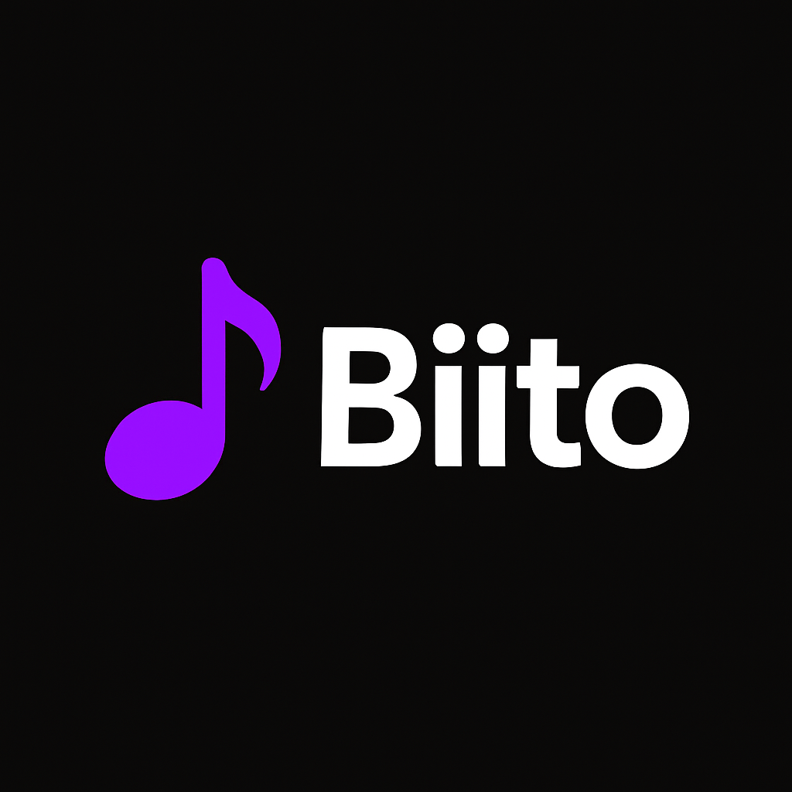

# 🎵 Biito - Local Music Streaming App

<div align="center">
  
  
  **Where your local music scene comes alive**
  
  [](https://expo.dev/)
  [](https://supabase.com/)
  [](https://www.typescriptlang.org/)
</div>

## 🎯 What is Biito?

Biito is a community-focused mobile music streaming app that connects local artists with listeners in their area. Unlike global platforms like Spotify, Biito focuses on homegrown talent, making it easy to discover and support amazing musicians right in your neighborhood.

## 🚀 The Problem We're Solving

- **Local musicians** struggle to get discovered on oversaturated global platforms
- **Music fans** miss out on incredible talent performing in their own communities  
- **Local music scenes** lack dedicated digital spaces to thrive
- **Artists** need simple, accessible tools to share their music

## ✨ Our Solution

A lightweight, community-focused music app that brings local scenes together:

### For Artists 🎵
- **Easy Profile Creation**: Set up your artist identity in minutes
- **Simple Upload Process**: Share your tracks with title, genre, and album info
- **Real-time Analytics**: Track play counts and engagement
- **Direct Fan Connection**: See who's following and supporting your music
- **Professional Presence**: Showcase your work with cover art and descriptions

### For Listeners 🎧
- **Local Discovery**: Find fresh talent right in your area
- **Seamless Streaming**: High-quality audio playback with intuitive controls
- **Personal Collections**: Like tracks and follow your favorite artists
- **Smart Search**: Find exactly what you're looking for
- **Community Engagement**: Support local artists through plays and follows

## 🛠️ Key Features

### 🎮 Core Functionality
- **Advanced Music Player**: Play, pause, skip with progress tracking and queue management
- **MP3 Upload System**: Artists can upload audio files up to 50MB with validation
- **Real-time Search**: Find tracks, artists, and albums instantly
- **User Authentication**: Secure signup/login with profile management
- **Social Features**: Like tracks, follow artists, build your music library

### 🔧 Technical Features
- **Cross-platform**: Native iOS and Android apps built with React Native
- **Cloud Storage**: Reliable file storage and streaming via Supabase
- **Offline Ready**: Progressive enhancement for poor network conditions
- **Performance Optimized**: Efficient state management and audio handling
- **Responsive Design**: Beautiful UI that works on all screen sizes

## 🏗️ Technical Architecture

### Frontend Stack
- **React Native (Expo)**: Cross-platform mobile development
- **TypeScript**: Type-safe development with better DX
- **Zustand**: Lightweight state management
- **React Native Track Player**: Professional audio playback

### Backend Stack
- **Supabase**: Backend-as-a-Service with PostgreSQL
- **Real-time Database**: Live updates and sync
- **Storage Buckets**: Secure file upload and CDN delivery
- **Row Level Security**: Fine-grained access control

### Architecture Patterns
- **Clean Architecture**: Separation of business logic, data, and presentation
- **Component-based UI**: Reusable, maintainable React components
- **Service Layer**: Dedicated services for API, auth, and audio handling
- **Store Pattern**: Centralized state management with reactive updates

## 📱 App Structure

```
src/
├── business/           # Business logic and custom hooks
│   └── hooks/
├── persistence/        # Data layer and state management
│   └── stores/
├── presentation/       # UI components and screens
│   └── components/
└── services/          # External integrations
    ├── api/           # Supabase client and API calls
    ├── auth/          # Authentication services
    ├── audio/         # Audio playback handling
    └── tracks/        # Music upload and management
```

## 🚀 Getting Started

### Prerequisites
- Node.js (v16 or higher)
- npm or yarn
- Expo CLI
- iOS Simulator or Android Emulator (or physical device)

### Installation

1. **Clone the repository**
   ```bash
   git clone <repository-url>
   cd SS2025_SWE201_Final
   ```

2. **Install dependencies**
   ```bash
   npm install
   ```

3. **Set up environment variables**
   ```bash
   # Create .env file with your Supabase credentials
   EXPO_PUBLIC_SUPABASE_URL=your_supabase_url
   EXPO_PUBLIC_SUPABASE_ANON_KEY=your_supabase_anon_key
   ```

4. **Start the development server**
   ```bash
   npm start
   ```

5. **Run on device/simulator**
   - Press `i` for iOS simulator
   - Press `a` for Android emulator
   - Scan QR code with Expo Go app on physical device

### Database Setup

1. **Create Supabase project** at [supabase.com](https://supabase.com)

2. **Run migrations**
   ```bash
   # Apply database schema
   npx supabase db push
   ```

3. **Configure storage buckets**
   - Create `audio-files` bucket for music uploads
   - Set appropriate permissions for authenticated users


## 🔮 Roadmap

### Phase 1 (Current) ✅
- [x] Core music streaming functionality
- [x] User authentication and profiles
- [x] Basic upload system
- [x] Search and discovery

### Phase 2 (Coming Soon) 🚧
- [ ] Cover image upload support
- [ ] Playlist creation and sharing
- [ ] Audio duration extraction
- [ ] Enhanced social features

### Phase 3 (Future) 📋
- [ ] Live streaming for virtual concerts
- [ ] Event integration and promotion
- [ ] Artist monetization features
- [ ] Advanced analytics dashboard


---

<div align="center">
  <p><strong>Biito: Empowering local music communities, one track at a time</strong> 🎶</p>
  
  Made with ❤️ for local music scenes everywhere
</div>
